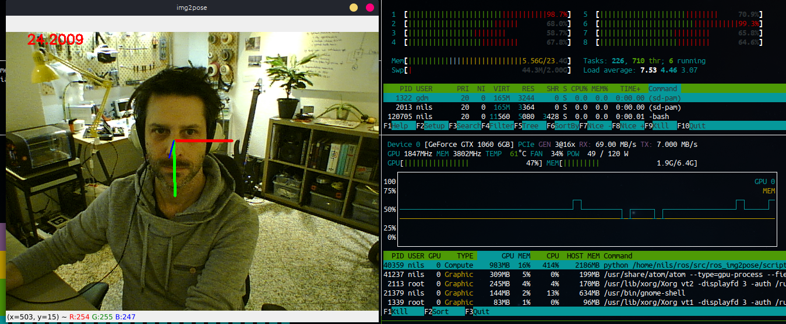

# ROS: img2pose

## Face Alignment and Detection via 6DOF Face Pose Estimation

[](https://creativecommons.org/licenses/by-nc/4.0/)[](https://paperswithcode.com/sota/head-pose-estimation-on-aflw2000?p=img2pose-face-alignment-and-detection-via)[](https://paperswithcode.com/sota/head-pose-estimation-on-biwi?p=img2pose-face-alignment-and-detection-via)

This repository provides a ROS wrapper node for **img2pose** neural network for six degrees of freedom (6DoF) detection on multiple faces without the need of prior face detection. The model included in this repository has been trained on WIDER FACE dataset. Original model and training instructions are available on the projects [github page](https://github.com/vitoralbiero/img2pose).



Running at ~24FPS on Intel i7-7700k@4.20GHz and GeForce GTX1060/6Gb

## Installation

 

Clone this repository into a catkin workspace, install dependencies with pip3 before running `catkin_make`.

```
pip3 install -r requirements.txt
```

## Usage

Before running it for the first time extract the included model:

```bash
cd models && ./extract_models.sh
```

There is currently a single wrapper node that loads the model, subscribes to a sensor_msgs/Image topic, runs the prediction in the image callback function and renders 6DOF head pose onto the frames in a form of colored axes.

```bash
rosrun ros_img2pose img2pose_node.py
```

*( default camera topic is `/head_camera/image_raw`*)

## Paper details

[Vítor Albiero](https://vitoralbiero.netlify.app), Xingyu Chen, [Xi Yin](https://xiyinmsu.github.io/), Guan Pang, [Tal Hassner](https://talhassner.github.io/home/), "*img2pose: Face Alignment and Detection via 6DoF, Face Pose Estimation,*" [arXiv:2012.07791](https://arxiv.org/abs/2012.07791), Dec., 2020


### Abstract

> We propose real-time, six degrees of freedom (6DoF), 3D face pose estimation without face detection or landmark localization. We observe that estimating the 6DoF rigid transformation of a face is a simpler problem than facial landmark detection, often used for 3D face alignment. In addition, 6DoF offers more information than face bounding box labels. We leverage these observations to make multiple contributions: (a) We describe an easily trained, efficient, Faster R-CNN--based model which regresses 6DoF pose for all faces in the photo, without preliminary face detection. (b) We explain how pose is converted and kept consistent between the input photo and arbitrary crops created while training and evaluating our model. (c) Finally, we show how face poses can replace detection bounding box training labels. Tests on AFLW2000-3D and BIWI show that our method runs at real-time and outperforms state of the art (SotA) face pose estimators. Remarkably, our method also surpasses SotA models of comparable complexity on the WIDER FACE detection benchmark, despite not been optimized on bounding box labels.


### Citation

If you use any part of our code or data, please cite our paper.

```
@article{albiero2020img2pose,
  title={img2pose: Face Alignment and Detection via 6DoF, Face Pose Estimation},
  author={Albiero, Vítor and Chen, Xingyu and Yin, Xi and Pang, Guan and Hassner, Tal},
  journal={arXiv preprint arXiv:2012.07791},
  year={2020}
}
```

## License

Check [license](https://github.com/vitoralbiero/img2pose/blob/main/license.md) for license details.